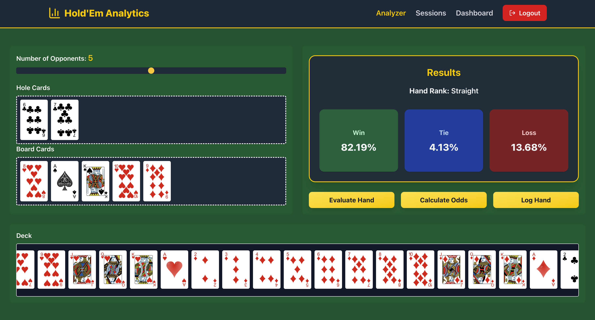
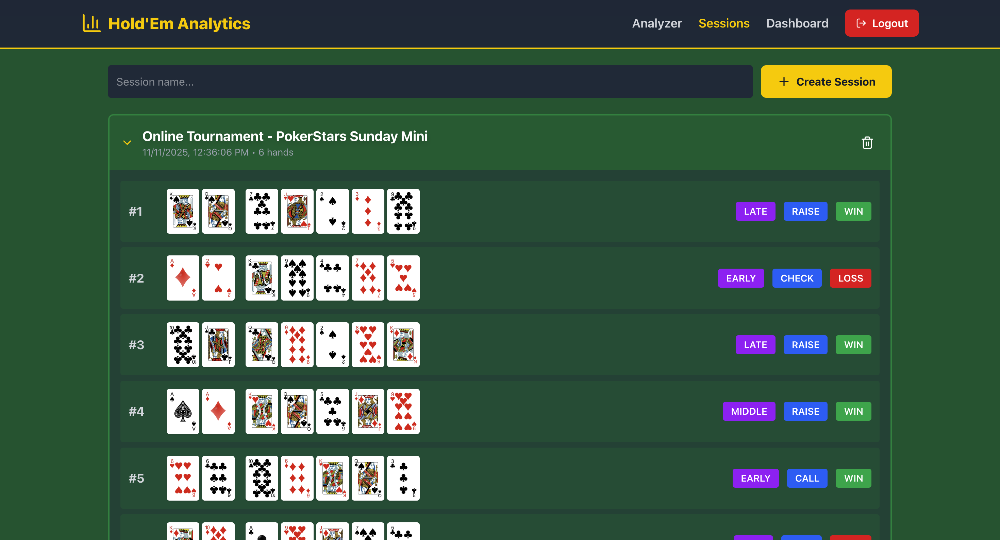
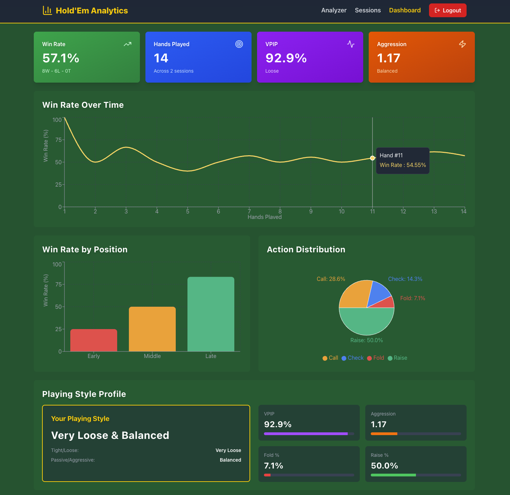

# Hold'Em Analytics

A poker analytics platform for hand evaluation, odds calculation, and session tracking.








## Features

### Interactive Gameplay
- **Interactive Card Interface:** Drag-and-drop cards to simulate real poker hands  
- **Hand Evaluator:** Instant hand strength calculation (Texas Hold’em)  
- **Odds Calculator:** Monte Carlo simulation to calculate win/tie/loss probabilities against 1–9 opponents  

### User & Session Management
- **User Authentication:** Secure JWT-based login and registration with password hashing (bcrypt)  
- **Session Management:** Log and track hands including **hole cards, board cards, position, action, and result**  
- **Hand History:** Review past hands organized by session with sortable/filterable tables  

### Analytics Dashboard
- **AnalyticsService:** Complete analytics engine with 10+ statistical methods  
- **Protected Analytics Routes:** 8 FastAPI endpoints for fetching analytics data securely  
- **Dashboard Visualizations:**
  - **StatsCards:** 4 metric cards showing Win Rate, Hands Played, VPIP, Aggression Factor  
  - **WinRateChart:** Line chart tracking win rate over time  
  - **PositionChart:** Bar chart showing win rate by position (early/middle/late)  
  - **ActionChart:** Pie chart showing action distribution (fold/check/call/raise)  
  - **StyleProfile:** Playing style analysis with derived metrics  
  - **SessionTable:** Performance of recent sessions  

### Statistics Tracked
- Win Rate, VPIP, Aggression Factor  
- Position Analysis (early/middle/late)  
- Action Patterns (fold/check/call/raise)  
- Win Rate Over Time  
- Session Performance  
- Playing Style Profile  


## Tech Stack

### Frontend
- Next.js + React + TypeScript  
- Tailwind CSS for responsive UI  
- Interactive charts: Recharts

### Backend
- Python + FastAPI + SQLModel  
- PostgreSQL database  
- JWT-based authentication with bcrypt for password security  
- AnalyticsService: Comprehensive statistical engine  

### Containerization
- Dockerized for easy deployment  


## Running the Project

### Prerequisites
- Docker and Docker Compose installed  

### Setup

1. Clone the repository:
    ```bash
    git clone 
    cd holdem-analytics
    ```

2. Create environment files:

    **Backend `.env` file:**
    ```bash
    DATABASE_URL=postgresql+asyncpg://postgres:postgres@db:5432/poker_db
    SECRET_KEY=your-secret-key-here-change-this-in-production
    ALGORITHM=HS256
    ACCESS_TOKEN_EXPIRE_MINUTES=30
    ```

    **Frontend `.env.local` file:**
    ```bash
    NEXT_PUBLIC_API_URL=http://localhost:8000
    ```

3. Build and start the application:
    ```bash
    docker compose up --build
    ```

4. Access the application:
    - Frontend: http://localhost:3000  
    - Backend API: http://localhost:8000  
    - API Docs: http://localhost:8000/docs  

### Stopping the Application
```bash
docker compose down
```

### Troubleshooting

If you encounter issues:
- Ensure ports 3000, 8000, and 5432 are not in use  
- Try `docker compose down -v` to remove volumes and rebuild  
- Check Docker logs with `docker compose logs`
