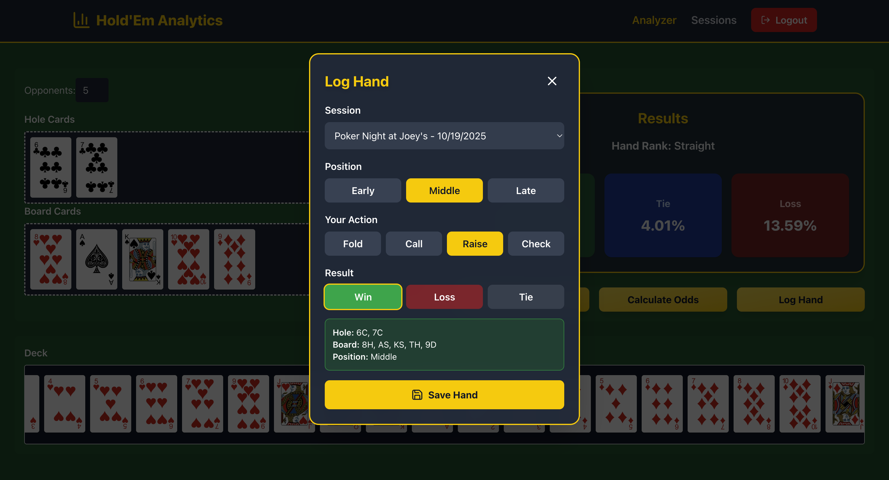

# Hold'Em Analytics

A poker analytics platform for hand evaluation, odds calculation, and session tracking.





## Features
- **Interactive Card Interface:** Drag-and-drop cards to simulate poker hands  
- **Hand Evaluator:** Instant hand strength analysis  
- **Odds Calculator:** Monte Carlo simulation for win/tie/loss probabilities against 1–9 opponents  
- **User Authentication:** Secure JWT-based login and registration  
- **Session Management:** Log and track hands with position, action, and result data  
- **Hand History:** Review past hands organized by session  

## Tech Stack
- **Frontend:** Next.js, React, TypeScript, Tailwind CSS  
- **Backend:** FastAPI, SQLModel, PostgreSQL  
- **Authentication:** JWT with bcrypt  
- **Containerization:** Docker  

## Running the Project

### Prerequisites
- Docker and Docker Compose installed  

### Setup

1. Clone the repository:
    ```bash
    git clone 
    cd holdem-analytics
    ```

2. Create environment files:

    **Backend `.env` file:**
    ```bash
    DATABASE_URL=postgresql+asyncpg://postgres:postgres@db:5432/poker_db
    SECRET_KEY=your-secret-key-here-change-this-in-production
    ALGORITHM=HS256
    ACCESS_TOKEN_EXPIRE_MINUTES=30
    ```

    **Frontend `.env.local` file:**
    ```bash
    NEXT_PUBLIC_API_URL=http://localhost:8000
    ```

3. Build and start the application:
    ```bash
    docker compose up --build
    ```

4. Access the application:
    - Frontend: http://localhost:3000  
    - Backend API: http://localhost:8000  
    - API Docs: http://localhost:8000/docs  

### Stopping the Application
```bash
docker compose down
```

### Troubleshooting

If you encounter issues:
- Ensure ports 3000, 8000, and 5432 are not in use  
- Try `docker compose down -v` to remove volumes and rebuild  
- Check Docker logs with `docker compose logs`
