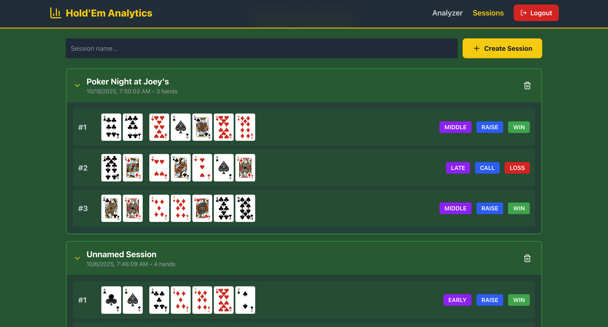

# Hold'Em Analytics

A poker analytics platform for hand evaluation, odds calculation, and session tracking.

**[Live Demo](https://holdem-analytics.com)** | **[API Documentation](http://98.93.1.240:8000/docs)**

## Features

### Interactive Gameplay
- **Interactive Card Interface:** Drag-and-drop cards to simulate real poker hands  
- **Hand Evaluator:** Instant hand strength calculation (Texas Hold'em)  
- **Odds Calculator:** Monte Carlo simulation to calculate win/tie/loss probabilities against 1–9 opponents  

### User & Session Management
- **User Authentication:** Secure JWT-based login and registration with password hashing (bcrypt)  
- **Session Management:** Log and track hands including hole cards, board cards, position, action, and result  
- **Hand History:** Review past hands organized by session

### Analytics Dashboard
- **AnalyticsService:** Complete analytics engine with 10+ statistical methods  
- **Dashboard Visualizations:**
  - **StatsCards:** 4 metric cards showing Win Rate, Hands Played, VPIP, Aggression Factor  
  - **WinRateChart:** Line chart tracking win rate over time  
  - **PositionChart:** Bar chart showing win rate by position (early/middle/late)  
  - **ActionChart:** Pie chart showing action distribution (fold/check/call/raise)  
  - **StyleProfile:** Playing style analysis with derived metrics  
  - **SessionTable:** Performance of recent sessions  

### Statistics Tracked
- Win Rate, VPIP, Aggression Factor  
- Position Analysis (early/middle/late)  
- Action Patterns (fold/check/call/raise)  
- Win Rate Over Time  
- Session Performance  
- Playing Style Profile  

## Tech Stack

### Frontend
- Next.js + React + TypeScript  
- Tailwind CSS for responsive UI  
- Interactive charts: Recharts
- Deployed on AWS Amplify with CI/CD

### Backend
- Python + FastAPI + SQLModel  
- PostgreSQL database  
- JWT-based authentication with bcrypt for password security  
- Dockerized and deployed on AWS EC2

### Infrastructure
- AWS EC2 (t3.micro) for containerized backend
- AWS RDS PostgreSQL (db.t3.micro)
- AWS Amplify for frontend hosting
- Custom domain with SSL

## Deployment

The application is deployed on AWS infrastructure:
- **Frontend:** AWS Amplify with automatic deployment from GitHub
- **Backend:** EC2 instance running Dockerized FastAPI application
- **Database:** RDS PostgreSQL with automated backups
- **Domain:** Custom domain with SSL certificate
